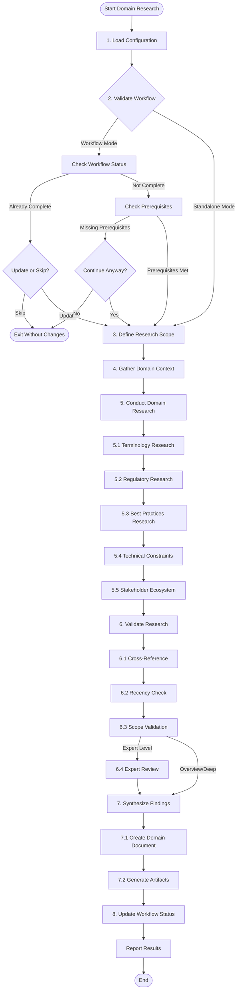

# Domain Research Workflow

## Purpose

This workflow conducts **deep domain-specific research** to build comprehensive understanding of the industry, domain terminology, regulatory landscape, and domain-specific best practices. Unlike general market research, this focuses on acquiring expert-level domain knowledge needed for building credible, compliant, and industry-appropriate solutions.

**Key outputs:**
- Domain terminology and concept glossary
- Industry standards and regulations inventory
- Domain-specific best practices and patterns
- Regulatory compliance requirements
- Industry stakeholder map
- Domain expert insights and validation
- Technical constraints specific to the domain

**Key Principle:** Domain expertise as a competitive advantage - Deep understanding of industry nuances enables better product decisions and credible solutions.

**When to use this workflow:**
- Building products in heavily regulated industries (healthcare, finance, legal, etc.)
- Entering unfamiliar domains with specialized terminology
- Creating industry-specific solutions requiring deep expertise
- Need to understand domain-specific technical constraints
- Validating product concepts with domain experts

**Prerequisites:**
- [ ] BMAD plugin installed in Claude Code
- [ ] Project initialized (`/bmad:meta:workflow-init`)
- [ ] Product brief created (recommended: `/bmad:phase-1:product-brief`)

## Variables

The following variables are used throughout this workflow:

| Variable | Source | Description | Example |
|----------|--------|-------------|---------|
| `{documentation_dir}` | `.bmad/config.yaml` | Where documentation files are stored | `.bmad` |
| `{user_name}` | `.bmad/config.yaml` | Author name for research document | `"Alex Domain Expert"` |
| `{bmad_folder}` | `.bmad/config.yaml` | BMAD installation location | `.bmad` |
| `{project_name}` | `.bmad/config.yaml` | Project name | `"Healthcare AI Platform"` |
| `{current_date}` | System date | Current date for documentation | `2025-11-18` |
| `{domain_name}` | User input | Target domain/industry | `"Healthcare"`, `"Financial Services"` |
| `{domain_subdomain}` | User input | Specific subdomain if applicable | `"Telemedicine"`, `"Payment Processing"` |
| `{geographic_scope}` | User input | Geographic/regulatory scope | `"US"`, `"EU"`, `"Global"` |
| `{research_depth}` | User input | Research depth level | `"overview"`, `"deep"`, `"expert"` |
| `{output_file}` | Generated | Domain research output path | `{documentation_dir}/domain-research.md` |

**Configuration file location:** `.bmad/config.yaml`

**Required input files:**
- `.bmad/config.yaml` - Project configuration

**Optional input files:**
- `.bmad/product-brief.md` - Product vision and context (highly recommended)
- `.bmad/research.md` - General market research (provides context)

## Instructions

### 1. Load Configuration and Context

Read project configuration from `.bmad/config.yaml`:

```javascript
{
  documentation_dir: string,      // Where docs are stored (e.g., .bmad)
  user_name: string,              // Author name
  bmad_folder: string,            // BMAD install location
  project_name: string            // Project name
}
```

Load existing context if available:
- Product brief: `{documentation_dir}/product-brief.md`
- Market research: `{documentation_dir}/research.md`

Extract domain hints from product brief or market research to pre-populate domain selection.

### 2. Validate Workflow Readiness

**Check for workflow status file:**

1. Check if `.bmad/bmm-workflow-status.yaml` exists

**If status file NOT found (standalone mode):**

Set `standalone_mode = true`

Display: "Domain Research can run standalone or as part of BMM workflow. Running in standalone mode - great for building deep domain expertise!"

**If status file found (workflow mode):**

1. Load COMPLETE file: `.bmad/bmm-workflow-status.yaml`
2. Parse `workflow_status` section
3. Check status of "domain-research" workflow
4. Get `project_level` from metadata
5. Find first non-completed workflow

**Validation checks:**

**If project_level < 2:**
```
¡ Domain Research is optional for Level 0-1 (Quick Flow)

Your project is Level {project_level} (Quick Flow). Domain Research is valuable for specialized industries but optional for general applications.

Continue with domain research anyway?
- Yes, conduct research (recommended for regulated/specialized domains)
- No, skip to tech-spec or PRD
```

**If domain-research already completed:**
```
 Domain Research already completed

Last updated: {completion_date}
Output: {documentation_dir}/domain-research.md

Options:
- Update existing research with new findings
- Skip to next workflow step
- Start fresh domain research
```

Ask user for choice. If skip, exit workflow and suggest next step from workflow status.

**If attempting out of sequence:**

Check if prerequisite workflows are complete. Recommended (but not required) prerequisites:
- `product-brief` - Provides domain context
- `research` - Provides market context

If prerequisites missing, display:
```
  Running domain research before recommended prerequisites

Recommended sequence:
1. product-brief (provides domain context)
2. research (provides market context)
3. domain-research (current)

You can continue, but having context from previous workflows improves research quality.

Proceed anyway? [Yes/No]
```

### 3. Define Domain Research Scope

Use `AskUserQuestion` to gather research parameters:

**Question 1 - Domain/Industry:**
```yaml
question: "What is your primary domain or industry?"
header: "Domain"
multiSelect: false
options:
  - label: "Healthcare & Medical"
    description: "Medical devices, healthcare IT, telemedicine, clinical systems"
  - label: "Financial Services"
    description: "Banking, payments, trading, insurance, fintech"
  - label: "Legal & Compliance"
    description: "Legal tech, compliance management, regulatory systems"
  - label: "Education & EdTech"
    description: "Learning platforms, educational tools, training systems"
```

If user selects "Other", prompt for custom domain name.

**Question 2 - Research Depth:**
```yaml
question: "How deep should the domain research go?"
header: "Depth"
multiSelect: false
options:
  - label: "Overview (30-45 min)"
    description: "Core terminology, major regulations, key stakeholders - good for familiar domains"
  - label: "Deep (1-2 hours)"
    description: "Comprehensive terminology, regulatory landscape, best practices - recommended for most projects"
  - label: "Expert (2-4 hours)"
    description: "Exhaustive research with expert validation, compliance deep-dive - for highly regulated domains"
```

Map selection: `"Overview"` ’ `overview`, `"Deep"` ’ `deep`, `"Expert"` ’ `expert`

**Question 3 - Geographic/Regulatory Scope:**
```yaml
question: "What is your geographic or regulatory scope?"
header: "Scope"
multiSelect: true
options:
  - label: "United States"
    description: "US federal and state regulations"
  - label: "European Union"
    description: "EU regulations (GDPR, MiFID, etc.)"
  - label: "United Kingdom"
    description: "UK-specific regulations post-Brexit"
  - label: "Global"
    description: "International standards and multi-jurisdiction compliance"
```

**Question 4 - Focus Areas:**
```yaml
question: "Which domain aspects are most important? (Select all that apply)"
header: "Focus"
multiSelect: true
options:
  - label: "Terminology & Concepts"
    description: "Industry jargon, technical terms, domain models"
  - label: "Regulations & Compliance"
    description: "Legal requirements, standards, certifications"
  - label: "Best Practices & Patterns"
    description: "Industry standards, design patterns, proven approaches"
  - label: "Technical Constraints"
    description: "Domain-specific technical limitations or requirements"
```

Store responses in variables:
- `{domain_name}` - Selected domain
- `{research_depth}` - Selected depth level
- `{geographic_scope}` - Array of selected regions
- `{focus_areas}` - Array of selected focus areas

### 4. Gather Domain Context

Before starting research, gather existing domain knowledge from the team:

Display:
```
=Ë Domain Context Gathering

Before conducting research, let's capture what you already know about this domain.
This helps focus research on gaps and validates findings against your experience.
```

Use `AskUserQuestion`:

```yaml
question: "Do you or your team have existing domain expertise?"
header: "Expertise"
multiSelect: false
options:
  - label: "Yes, significant expertise"
    description: "Team has domain experts or extensive experience"
  - label: "Some familiarity"
    description: "Team has worked in this domain but not as experts"
  - label: "Limited knowledge"
    description: "Team is new to this domain"
  - label: "Complete newcomers"
    description: "No prior domain experience"
```

If "Yes" or "Some familiarity", prompt:
```
Please share key domain knowledge you already have:
- Critical terminology you're aware of
- Known regulations or standards
- Specific challenges or constraints you've identified
- Domain experts you have access to

[User provides context]
```

Store in `{existing_domain_knowledge}` for research validation.

### 5. Conduct Domain Research

Based on `{research_depth}` level, conduct research in the following areas. Mark each area as you complete it:

**5.1 Terminology and Concepts Research**

If "Terminology & Concepts" in `{focus_areas}`:

1. **Core Terminology:**
   - Research industry-specific terms, jargon, and acronyms
   - Identify domain models and conceptual frameworks
   - Map terminology to plain language equivalents
   - Document common misconceptions or ambiguous terms

2. **Domain Concepts:**
   - Research fundamental concepts and principles
   - Identify key domain entities and relationships
   - Understand domain-specific workflows and processes
   - Map concept hierarchies and taxonomies

**Research Sources:**
- Industry glossaries and terminology databases
- Professional association resources
- Domain-specific textbooks and standards
- Expert blogs and publications

**Output:** Create glossary section with terms, definitions, and usage context.

**5.2 Regulatory and Compliance Research**

If "Regulations & Compliance" in `{focus_areas}`:

For each region in `{geographic_scope}`:

1. **Regulatory Framework:**
   - Identify governing bodies and regulatory agencies
   - List key regulations, laws, and standards
   - Document compliance requirements and thresholds
   - Map regulatory change timeline and upcoming changes

2. **Compliance Requirements:**
   - Data handling and privacy requirements
   - Security and audit requirements
   - Licensing and certification needs
   - Reporting and documentation obligations

3. **Penalties and Enforcement:**
   - Document penalties for non-compliance
   - Understand enforcement mechanisms
   - Identify common compliance failures

**For Expert-level research:**
- Analyze recent regulatory actions and case studies
- Review enforcement trends
- Consult regulatory guidance documents
- Document gray areas and interpretation challenges

**Research Sources:**
- Government regulatory websites
- Legal databases and law firm publications
- Compliance software vendor resources
- Industry compliance associations

**Output:** Create regulatory compliance section with requirements matrix organized by jurisdiction.

**5.3 Best Practices and Patterns Research**

If "Best Practices & Patterns" in `{focus_areas}`:

1. **Industry Standards:**
   - Research accepted industry standards (ISO, IEEE, etc.)
   - Identify certification programs and frameworks
   - Document quality benchmarks and KPIs
   - Map maturity models and assessment frameworks

2. **Design Patterns:**
   - Research common solution patterns in the domain
   - Identify anti-patterns and common mistakes
   - Document proven architectural approaches
   - Understand integration patterns with domain systems

3. **Operational Best Practices:**
   - Research operational workflows and processes
   - Identify industry benchmarks and metrics
   - Document service level expectations
   - Understand support and maintenance patterns

**Research Sources:**
- Industry standards organizations (ISO, NIST, etc.)
- Professional certifications and training materials
- Vendor best practice guides
- Case studies and whitepapers

**Output:** Create best practices section with categorized recommendations and rationale.

**5.4 Technical Constraints Research**

If "Technical Constraints" in `{focus_areas}`:

1. **Technology Standards:**
   - Research mandated or de-facto technical standards
   - Identify required data formats and protocols
   - Document interoperability requirements
   - Map legacy system constraints

2. **Performance Requirements:**
   - Research domain-specific performance expectations
   - Identify scalability requirements
   - Document availability and reliability standards
   - Understand data volume and velocity constraints

3. **Security Requirements:**
   - Research domain-specific security standards
   - Identify encryption and access control requirements
   - Document audit trail and logging needs
   - Understand threat models specific to domain

**Research Sources:**
- Technical standards bodies
- Industry architecture references
- Vendor technical documentation
- Security frameworks and guidelines

**Output:** Create technical constraints section with requirements and justifications.

**5.5 Stakeholder and Ecosystem Research**

For all research levels:

1. **Key Stakeholders:**
   - Identify primary user roles and personas in the domain
   - Map organizational hierarchies and decision-makers
   - Document stakeholder priorities and concerns
   - Understand stakeholder communication patterns

2. **Ecosystem Mapping:**
   - Identify key vendors and solution providers
   - Map integration partners and platforms
   - Document industry associations and communities
   - Understand ecosystem power dynamics

3. **Expert Network:**
   - Identify domain experts and thought leaders
   - Document expert publications and resources
   - Map consulting and advisory firms
   - Identify potential validation sources

**For Expert-level research:**
- Reach out to domain experts for validation interviews
- Attend virtual industry events or webinars
- Review academic research in the domain
- Analyze patent filings and innovation trends

**Output:** Create stakeholder map and ecosystem diagram.

### 6. Validate Domain Research

**6.1 Cross-Reference Validation**

Cross-check findings across multiple sources:
- Verify regulatory information against official sources
- Confirm terminology with multiple authoritative sources
- Validate best practices across multiple industry sources
- Check for contradictions or inconsistencies

**6.2 Recency Validation**

Check that research is current:
- Verify regulation effective dates
- Confirm standards are current versions
- Check for recent industry changes
- Identify deprecated practices or terminology

**6.3 Scope Validation**

Ensure research matches project needs:
- Compare findings to product brief requirements
- Verify coverage of critical areas
- Identify gaps in research scope
- Confirm depth is appropriate for project level

**For Expert-level research:**

If `{existing_domain_knowledge}` indicates team has domain experts, validate findings:
- Review research document with domain experts
- Confirm interpretations and priorities
- Identify any critical missing elements
- Get expert sign-off on findings

### 7. Synthesize Research Findings

Organize research into a cohesive domain knowledge document:

**7.1 Create Domain Research Document**

Generate document at `{output_file}` with the following structure:

```markdown
# Domain Research: {domain_name}

**Project:** {project_name}
**Research Scope:** {domain_subdomain} | {geographic_scope}
**Research Depth:** {research_depth}
**Completed:** {current_date}
**Author:** {user_name}

## Executive Summary

[2-3 paragraphs summarizing:]
- Domain complexity and key challenges
- Critical regulatory considerations
- Most important findings for product development
- Recommended next steps

## Domain Overview

### Industry Context
[Industry landscape, market structure, key trends]

### Core Domain Model
[Fundamental concepts and relationships in the domain]

## Terminology Glossary

[If "Terminology & Concepts" researched:]

### Essential Terms
[Core terminology table with term, definition, usage notes]

### Domain Concepts
[Key concepts with explanations and relationships]

### Common Misconceptions
[Terminology that is often confused or misunderstood]

## Regulatory Landscape

[If "Regulations & Compliance" researched:]

### Regulatory Framework by Jurisdiction

#### {Region 1}
- **Governing Bodies:** [List agencies]
- **Key Regulations:** [Regulation name, scope, requirements]
- **Compliance Thresholds:** [When requirements apply]
- **Enforcement:** [Penalties, mechanisms]

[Repeat for each region in {geographic_scope}]

### Compliance Requirements Matrix

| Requirement | Jurisdiction | Applicability | Implementation Notes |
|-------------|--------------|---------------|---------------------|
| [e.g., Data Encryption] | [US, EU] | [All systems] | [AES-256 minimum] |

### Regulatory Risks and Considerations

[Analysis of regulatory complexity, risks, gray areas]

## Best Practices and Standards

[If "Best Practices & Patterns" researched:]

### Industry Standards

| Standard | Organization | Scope | Adoption Level |
|----------|--------------|-------|----------------|
| [e.g., HL7 FHIR] | [HL7] | [Healthcare data exchange] | [Mandatory] |

### Design Patterns and Approaches

[Documented patterns with rationale and examples]

### Anti-Patterns to Avoid

[Common mistakes and why they fail in this domain]

### Quality Benchmarks

[Industry KPIs, SLAs, and performance expectations]

## Technical Constraints

[If "Technical Constraints" researched:]

### Technology Standards

[Required or de-facto standard technologies, protocols, formats]

### Performance Requirements

[Domain-specific performance expectations and constraints]

### Security Requirements

[Security standards, controls, and threat models]

### Integration Requirements

[Interoperability needs, legacy system constraints]

## Stakeholder Ecosystem

### Primary Stakeholders

[Key user roles, decision-makers, influencers]

### Industry Ecosystem Map

[Vendors, partners, platforms, associations]

### Domain Experts and Resources

[Thought leaders, publications, communities, validation sources]

## Implications for Product Development

### Critical Success Factors

[What matters most for credibility and success in this domain]

### Domain-Specific Product Requirements

[Requirements derived from domain research]

### Risk Mitigation Strategies

[How to address regulatory, technical, or domain-specific risks]

### Recommended Domain Validation

[Suggestions for expert review, testing, or validation]

## Research Methodology

### Research Sources

[List of authoritative sources consulted]

### Validation Approach

[How findings were verified and cross-checked]

### Limitations and Gaps

[Areas not fully researched or requiring additional investigation]

### Recommended Follow-up Research

[Suggestions for deeper investigation if needed]

## Appendices

### Appendix A: Full Terminology Reference

[Comprehensive glossary if extensive]

### Appendix B: Regulatory Reference Links

[Direct links to regulations and guidance]

### Appendix C: Expert Contacts

[Domain experts identified for potential consultation]

### Appendix D: Change Log

[Track updates to domain research as domain evolves]
```

**7.2 Generate Summary Artifacts**

Create supporting documents:

**Domain Quick Reference** (`{documentation_dir}/domain-quick-ref.md`):
- One-page terminology cheat sheet
- Critical regulations checklist
- Key stakeholder contacts
- Common pitfalls to avoid

**Compliance Checklist** (`{documentation_dir}/domain-compliance-checklist.md`):
- Jurisdiction-specific compliance requirements
- Checkboxes for each requirement
- Implementation notes
- Evidence/documentation needed

### 8. Update Workflow Status

**If running in workflow mode:**

Update `.bmad/bmm-workflow-status.yaml`:

```yaml
workflow_status:
  domain-research:
    status: completed
    completed_at: "{current_date}"
    output_files:
      - "{output_file}"
      - "{documentation_dir}/domain-quick-ref.md"
      - "{documentation_dir}/domain-compliance-checklist.md"
    notes: "Domain: {domain_name}, Depth: {research_depth}, Scope: {geographic_scope}"
```

**If running in standalone mode:**

Skip workflow status update.

## Workflow

This section describes the execution flow and sequence:



**Execution Flow Summary:**

1. **Configuration & Validation** (Steps 1-2): Load config, check workflow status, validate prerequisites
2. **Scope Definition** (Steps 3-4): Define research parameters, gather existing domain knowledge
3. **Research Execution** (Step 5): Conduct research across focus areas based on depth level
4. **Validation** (Step 6): Cross-reference, verify recency, validate scope, expert review if applicable
5. **Synthesis** (Step 7): Create comprehensive domain document and supporting artifacts
6. **Completion** (Step 8): Update workflow status and report results

**Depth-based Execution:**

- **Overview (30-45 min):** Light research in each focus area, emphasize breadth over depth
- **Deep (1-2 hours):** Comprehensive research with detailed documentation, recommended default
- **Expert (2-4 hours):** Exhaustive research with expert validation and compliance deep-dive

**Parallel Research Opportunities:**

Steps 5.1-5.5 can be executed in parallel if using multiple research agents, then synthesized in step 7.

## Report

Upon completion, provide the following report to the user:

### Completion Summary

```
 Domain Research Complete

Domain: {domain_name} ({domain_subdomain})
Research Depth: {research_depth}
Geographic Scope: {geographic_scope}
Focus Areas: {focus_areas}

=Ä Generated Documents:
- {output_file}
- {documentation_dir}/domain-quick-ref.md
- {documentation_dir}/domain-compliance-checklist.md

ñ Research Time: {elapsed_time}
```

### Key Findings Highlights

Present 3-5 most critical findings:

```
= Critical Findings:

1. [Most important regulatory requirement or constraint]
   Impact: [How this affects product development]

2. [Key technical constraint or standard]
   Impact: [Implementation implications]

3. [Critical terminology or concept]
   Impact: [How this shapes product design]

[Continue for top 3-5 findings...]
```

### Domain Complexity Assessment

```
=Ê Domain Complexity: [Low / Medium / High / Very High]

Justification:
- Regulatory Complexity: [Simple / Moderate / Complex / Very Complex]
- Technical Constraints: [Minimal / Some / Significant / Extensive]
- Stakeholder Complexity: [Few / Multiple / Many / Highly Complex]
- Terminology Specialization: [General / Specialized / Highly Technical / Expert-only]
```

### Recommendations

```
=¡ Recommendations:

1. [Key recommendation based on findings]
2. [Suggestion for domain expertise on team]
3. [Compliance strategy recommendation]
4. [Technical approach recommendation]
5. [Validation or expert review needs]
```

### Next Steps

**If running in workflow mode:**

```
<¯ Suggested Next Steps:

Based on workflow status, you should next:
1. [{next_workflow_step}] - [Brief description of next workflow]
2. Consider domain expert consultation for validation
3. Review findings with technical team for feasibility assessment

Run: /bmad:workflow-status to see full workflow progress
```

**If running in standalone mode:**

```
<¯ Suggested Next Steps:

1. Review domain research document with team
2. Consult domain experts for validation (if Expert level)
3. Use findings to inform:
   - PRD development (technical requirements from domain constraints)
   - Architecture decisions (technical standards and integration needs)
   - Compliance strategy (regulatory requirements)
4. Update research as domain evolves or regulations change

To integrate with BMM workflow: Run /bmad:meta:workflow-init
```

### Research Quality Indicators

```
 Research Quality Checklist:

[] Multiple authoritative sources consulted per finding
[] All regulations verified against official sources
[] Terminology cross-referenced across sources
[] Recent publications reviewed (< 12 months old)
[] Industry standards current versions confirmed
[] Expert validation completed (if Expert level)
[ ] Gaps or areas requiring additional research identified
```

### Access Documentation

```
=Ö View Your Domain Research:

Read document:
  cat {output_file}

View quick reference:
  cat {documentation_dir}/domain-quick-ref.md

Review compliance checklist:
  cat {documentation_dir}/domain-compliance-checklist.md
```

### Warnings and Caveats

If any limitations or gaps were identified:

```
  Important Notes:

- [Any areas where research was limited]
- [Regulatory changes pending that may affect findings]
- [Areas requiring expert validation before relying on findings]
- [Jurisdictions or aspects not fully researched]

Recommendation: [What to do about these limitations]
```

### Feedback Request

```
=¬ Research Feedback:

Was this domain research helpful? Areas for improvement:
- Was the depth level appropriate?
- Were focus areas correctly prioritized?
- Any critical aspects missing?
- Should any areas be researched more deeply?

[Capture user feedback for research quality improvement]
```
